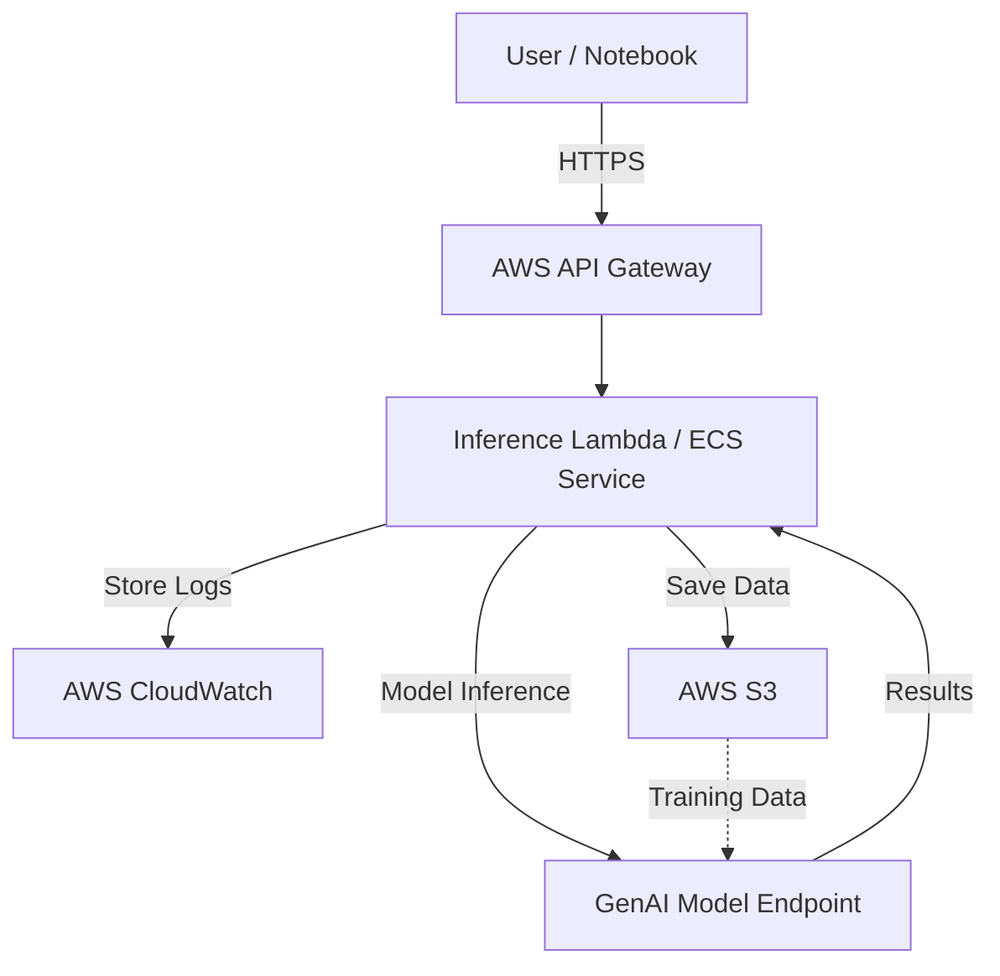

# End-to-End GenAI on AWS

## Introduction

End-to-End GenAI on AWS is a complete solution for deploying, managing, and operating generative AI applications using Amazon Web Services. This repository provides a ready-to-use framework that leverages AWS services and best practices for scalable, secure, and cost-effective GenAI workloads. It enables organizations to accelerate their adoption of generative AI by addressing infrastructure, deployment, and integration challenges.

## Features

- Automated AWS infrastructure provisioning for GenAI workloads
- Integration with popular generative AI models and frameworks
- Secure API deployment with authentication and access control
- Logging, monitoring, and alerts using AWS-native tools
- Scalable architecture with auto-scaling and cost-optimization
- Sample notebooks and scripts for rapid experimentation
- CI/CD pipeline integration for continuous deployment
- Configurable to support various GenAI use cases (text, image, code, etc.)

## Requirements

To use End-to-End GenAI on AWS, you will need:

- An AWS account with permissions to deploy resources (EC2, S3, Lambda, IAM, etc.)
- AWS CLI installed and configured locally
- Python 3.8+ installed on your local machine
- Docker (for local development and container builds)
- Terraform (if using IaC modules)
- Access to model weights or APIs for GenAI models, if required

## Installation

Follow these steps to set up the project:

1. **Clone the Repository**
    ```bash
    git clone https://github.com/SameaSaeed/End-to-End_GenAI_AWS.git
    cd End-to-End_GenAI_AWS
    ```

2. **Install Python Dependencies**
    ```bash
    python3 -m venv venv
    source venv/bin/activate
    pip install -r requirements.txt
    ```

3. **Configure AWS Credentials**
    - Set up your AWS credentials:
    ```bash
    aws configure
    ```

4. **Deploy Infrastructure**
    - If using Terraform:
    ```bash
    cd infrastructure
    terraform init
    terraform apply
    ```
    - If using CloudFormation, run:
    ```bash
    aws cloudformation deploy --template-file template.yaml --stack-name GenAIStack
    ```

5. **Build and Deploy Application**
    - Build Docker images (if applicable):
    ```bash
    docker build -t genai-app .
    ```
    - Push images to ECR or deploy to ECS/Lambda per your configuration.

## Usage

After installation and deployment, you can interact with the GenAI endpoints:

- Use provided Jupyter notebooks for sample queries and workflows
    ```bash
    cd notebooks
    jupyter notebook
    ```

- Make API requests to the deployed endpoints (see the API documentation below for details)

- Monitor logs, metrics, and alerts via AWS CloudWatch and other integrated tools

### Example Query (using Python requests)
```python
import requests

url = "https://your-api-endpoint.amazonaws.com/genai"
headers = {"Authorization": "Bearer <your-token>"}
payload = {"prompt": "Write an AWS README generator."}

response = requests.post(url, json=payload, headers=headers)
print(response.json())
```

## Configuration

You can customize the deployment and application behavior via configuration files:

- **config.yaml**: Main configuration for model parameters, endpoints, and runtime options
- **infrastructure/variables.tf**: Terraform variables for infrastructure size, region, and resource limits
- **.env**: Environment-specific variables (API keys, secrets, etc.)

### Configuration Options

- **Model Selection:** Choose which GenAI model to deploy (e.g., GPT, Stable Diffusion)
- **API Authentication:** Configure API keys, JWT, or OAuth for secure access
- **Scaling Parameters:** Set min/max autoscaling group sizes
- **Logging Levels:** Adjust verbosity and destinations for logs
- **Data Locations:** Specify S3 buckets or EFS for input/output data

### Example config.yaml
```yaml
model:
  name: gpt-3
  endpoint: https://api.openai.com/v1/engines/gpt-3/completions
  api_key: <your-key>
inference:
  max_tokens: 500
  temperature: 0.7
logging:
  level: INFO
  destination: cloudwatch
```

---

## Architecture Overview

The following diagram shows the high-level architecture for the End-to-End GenAI on AWS solution:



---

## Support and Contributing

- Issues and pull requests are welcome! Please open them on the repository's GitHub page.
- For feature requests or questions, use the Discussions tab.
- Refer to the CONTRIBUTING.md file for development guidelines.